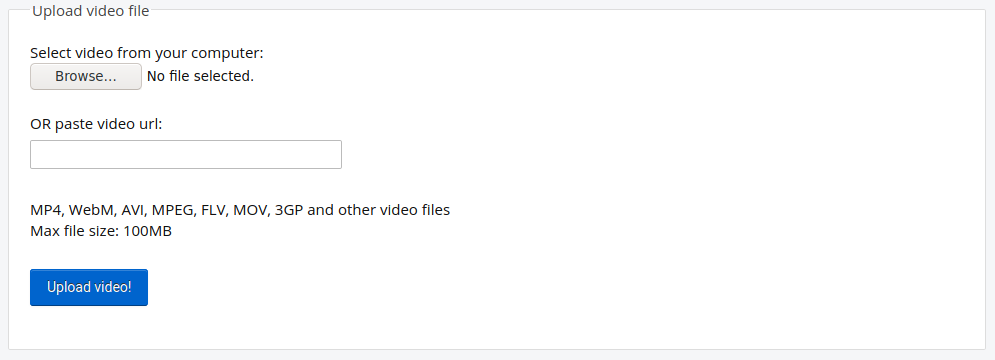

## 동영상 녹화하기

동영상을 스크래치에 추가할 수는 없지만 GIF를 넣을 수는 있습니다. 스프라이트로 GIF를 가져오면 스크래치가 GIF를 프레임별로 나누고, GIF의 각 프레임은 새로운 스프라이트의 새로운 코스튬이 됩니다.

**만들려고 하는 동영상은 인터넷에 공개되므로, 동영상 파일 내에 자신의 이름이나 동영상 녹화 위치정보를 알아낼 수 있는 부분이 없는지 확인하고, 동영상을 촬영하기 전에 먼저 동영상을 만들고 사용할 수 있도록 부모님께 허락을 받아야 합니다.**

--- task ---

아래 축소된 부분을 참고하여 컴퓨터의 웹캠을 사용하여 몇 초 동안 비디오를 녹화한 다음, 동영상을 컴퓨터에 저장합니다.

--- /task ---

--- collapse ---
---

title: 윈도우에서 웹캠 녹화하기

---
- **시작** 메뉴를 클릭하고 **카메라** 앱을 실행합니다.

- **동영상 촬영** 버튼을 클릭해 짧은 영상을 녹화합니다.

- 당신의 영상은 `Pictures\Camera Roll`(카메라 앨범) 폴더에 있을 것입니다.

--- /collapse ---

--- collapse ---
---

title: 맥 os에서 웹캠 녹화하기

---
- **응용 프로그램** 메뉴로 이동하여 QuickTime Player를 실행합니다.

- **파일**> **새로운 동영상 녹화**를 클릭하고 알림창이 표시되면 카메라 접근을 허용하세요.

- 완료하면 동영상을 저장하거나 내보낼 수 있으며, 이 비디오가 바탕 화면에 나타납니다.

--- /collapse ---

--- collapse ---
---

title: 크롬 os에서 웹캠 녹화하기

---

- 앱 아이콘을 클릭하고 **카메라** 앱을 검색합니다.

- 오른쪽에 있는 **비디오**을 선택한 다음 **녹화** 버튼을 클릭합니다.

- 작업을 마치면 **녹화** 버튼을 다시 클릭하면 `Videos` 폴더에 파일이 있습니다.

--- /collapse ---

이제 동영상이 준비되었으므로 동영상 파일을 GIF로 변환해야합니다. 이 작업을 쉽게 수행할 수 있는 방법은 [rpf.io/gif에 있는 변환기](https://rpf.io/gif){:target="_blank"}를 사용하는 것입니다.

--- task ---

먼저 동영상을 업로드하십시오. **파일 선택** 버튼을 클릭하고 파일을 클릭한 다음 **Upload** 버튼을 클릭합니다.

--- /task ---

--- task ---

스크래치에서 좀 더 빠르게 실행하게 하려면 GIF를 최적화해야 합니다. 이렇게 하려면 **Optimize**에 체크합니다. 해상도를 낮출 수도 있습니다.

--- /task ---

--- task ---

**Convert** 버튼을 클릭하고 GIF가 생성되면 **Save** 아이콘을 클릭하여 GIF를 저장합니다.

 

--- /task ---

--- task ---

끝나면 `다운로드` 폴더를 확인하세요.

--- /task ---

