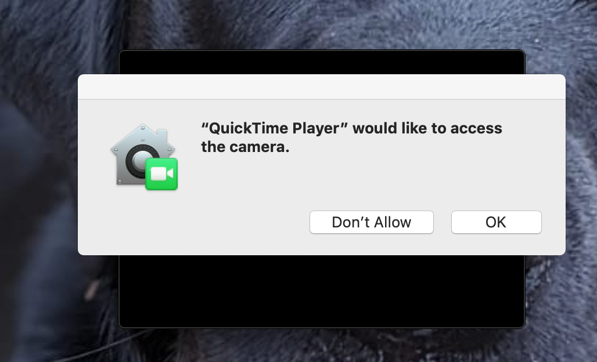

## 동영상 녹화하기

동영상을 스크래치에 추가할 수는 없지만 GIF를 넣을 수는 있습니다. 스프라이트로 GIF를 가져오면 스크래치가 GIF를 프레임별로 나누고, GIF의 각 프레임은 새로운 스프라이트의 새로운 코스튬이 됩니다.

**만들려고 하는 동영상은 인터넷에 공개되므로, 동영상 파일 내에 자신의 이름이나 동영상 녹화 위치정보를 알아낼 수 있는 부분이 없는지 확인하고, 동영상을 촬영하기 전에 먼저 동영상을 만들고 사용할 수 있도록 부모님께 허락을 받아야 합니다.**

--- task ---

아래 축소된 부분을 참고하여 컴퓨터의 웹캠을 사용하여 몇 초 동안 비디오를 녹화한 다음, 동영상을 컴퓨터에 저장합니다.

--- /task ---

--- collapse ---
---

title: 윈도우에서 웹캠 녹화하기

---
- **시작** 메뉴를 클릭하고 **카메라** 앱을 실행합니다.

- **동영상 촬영** 버튼을 클릭해 짧은 영상을 녹화합니다.

- 당신의 영상은 `Pictures\Camera Roll`(카메라 앨범) 폴더에 있을 것입니다.

--- /collapse ---

--- collapse ---
---

title: Recording webcam video on macOS

---
- Go to your **Applications** menu and open QuickTime Player.

- Click on **File** > **New Movie Recording**, then allow access to the camera when prompted.

- When you have finished, you can save or export your video, and it should appear on your desktop.

--- /collapse ---

--- collapse ---
---

title: Recording webcam video on Chrome OS

---

- Click on your application launcher and search for the **Camera** app.

- Select **Video** on the right-hand side, and then click the **Record** button.

- When you have finished, click the **Record** button again, and you will find your file in the `Videos` folder.

--- /collapse ---

Now that you have the video, you need to convert it to a GIF. An easy way to do this is to use [the converter at rpf.io/gif](https://rpf.io/gif){:target="_blank"}.

--- task ---

First, upload your video: click the **Browse** button, click on your file, then click the **Upload** button.

--- /task ---

--- task ---

To make things a little faster in Scratch, you should optimise the GIF. To do this, select the **Optimize** checkbox. You might also like to reduce the resolution.

--- /task ---

--- task ---

Click the **Convert** button, and when the GIF has been created, click on the **Save** icon to save your GIF.

 

--- /task ---

--- task ---

When you have finished, check your `Downloads` folder for the GIF.

--- /task ---

