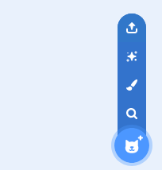
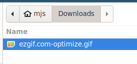

## 스크래치에 GIF를 추가하고 움직이게 하는 방법

--- task ---

[rpf.io/scratch-new](https://rpf.io/scratch-new)으로 이동하여 새 Scratch 프로젝트를 엽니다.

--- /task ---

--- task ---

**휴지통** 아이콘을 클릭해서 기본 스크래치 고양이 스프라이트를 삭제합니다.


--- /task ---

--- task ---

이제 ** 스프라이트 선택** 버튼 위에 커서를 올려놓고** 스프라이트 업로드**를 클릭하여 새 스프라이트를 업로드합니다.



--- /task ---

--- task ---

파일 탐색기에서 GIF를 선택해 업로드하세요.



--- /task ---

--- task ---

새 스프라이트에 대한 **모양** 탭을 클릭해서 GIF의 모든 프레임을 볼 수 있습니다.


다음 챕터에서 중요하므로, 현재 모양의 개수를 기록해 두시기 바랍니다.

--- /task ---

--- task ---

GIF를 재생하려면 `무한 반복하기`{:class="block3control"} 블록 안에 `반복하기`{:class="block3control"} 블록을 넣어 사용할 수 있습니다. `반복`{:class="block3control"} 블록은 GIF의 프레임 수와 일치해야 합니다.

```blocks3
when flag clicked
forever
repeat (35)
next costume
```
--- /task ---

--- task ---

애니메이션 속도가 약간 빠를 수 있으므로 `기다리기`{:class="block3control"} 블록을 추가하여 속도를 약간 낮춥니다.


```blocks3
when flag clicked
forever
repeat (35)
+wait (0.04) seconds
next costume
```

--- /task ---

--- task ---

또한 애니메이션의 크기를 늘리고 위치를 스테이지의 중앙으로 변경할 수도 있습니다.

```blocks3
when flag clicked
+set size to (150) %
forever
repeat (35)
+wait (0.04) seconds
next costume
```

--- /task ---

--- task ---

항상 첫 번째 모양부터 애니메이션이 시작되도록 하는 것도 도움 됩니다.

```blocks3
when flag clicked
+switch costume to (ezgif v)
set size to (150) %
forever
repeat (35)
+wait (0.04) seconds
next costume
```

--- /task ---


--- task ---

녹색 깃발을 클릭하여 스테이지에서 재생 중인 비디오를 봅니다.

--- /task ---


