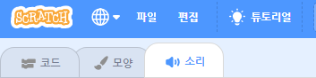
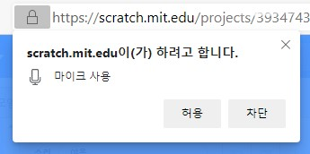
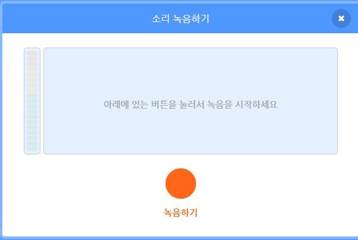

## 소리 추가하기

--- task ---

스프라이트의 **소리** 탭을 클릭합니다.



--- /task ---

--- task ---

화면의 왼쪽 하단 모서리에서 **소리 고르기** 버튼 위에 커서를 올린 후, **녹음하기**를 선택하여 새 소리를 녹음합니다.


--- /task ---

--- task ---

웹 브라우저가 마이크에 액세스하도록 허용해야 할 수도 있습니다. 이렇게 하려면 **허용**을 클릭하세요



--- /task ---

--- task ---

목소리를 녹음하기 위해 **녹음하기** 버튼을 클릭하세요. 전자 카드 수신자에게 보낼 내용을 다 말했다면 **녹음 중지**를 클릭한 다음 **저장**을 클릭합니다.



--- /task ---

--- task ---

사운드를 재생하려면 애니메이션 반복이 시작될 때 `신호 보내기`{:class="block3control"} 블록을 사용할 수 있습니다.

```blocks3
when flag clicked
switch costume to (ezgif v)
set size to (150) %
forever
+broadcast (message1 v)
repeat (35)
next costume
```

--- /task ---

--- task ---

그런 다음 `신호를 받았을 때`{:class="block3control"} 블록을 사용하여 소리를 재생합니다.

```blocks3
when I receive (message1 v)
play sound (recording1 v) until done
```

--- /task ---

--- task ---

`기다리기`{:class="block3control"} 블록을 사용하여 소리가 재생되기 시작하는 시점을 제어할 수 있습니다.

```blocks3
when I receive (message1 v)
+wait (0.4) seconds
play sound (recording1 v) until done
```

--- /task ---


