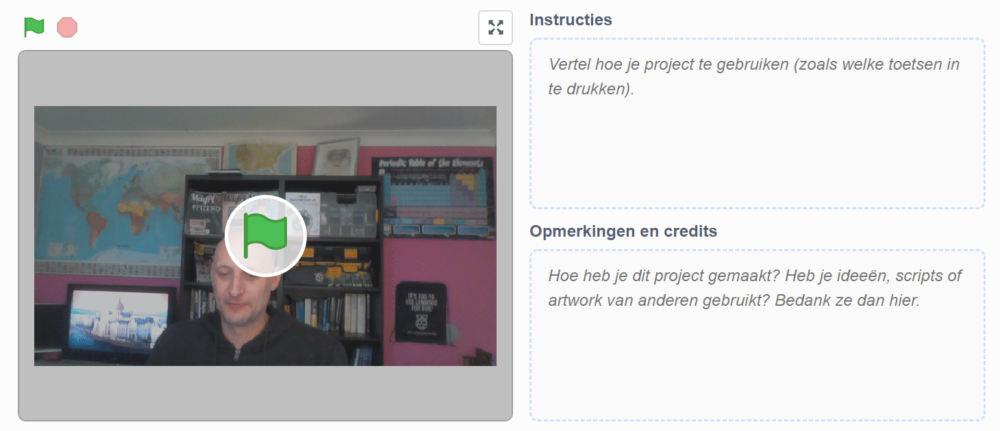

## Inleiding

In dit project gebruik je het Scratch-platform om een audiovisuele e-card te maken die je naar vrienden en familie kunt sturen.

### Wat ga je maken

--- no-print --- Klik op de groene vlag om de e-card te bekijken. <iframe src="https://scratch.mit.edu/projects/385557938/embed" allowtransparency="true" width="485" height="402" frameborder="0" scrolling="no" allowfullscreen mark="crwd-mark"></iframe>

--- /no-print ---

--- print-only ---  --- /print-only ---

--- collapse ---
---
title: Wat heb je nodig
---
### Hardware

- Een computer met een webcam en microfoon
- Een internetverbinding

### Software

- Scratch 3 (of [online](http://rpf.io/scratchon) of [offline](http://rpf.io/scratchoff))
- Een webbrowser

--- /collapse ---

--- collapse ---
---
title: Wat ga je leren
---

- Hoe een video naar een GIF te converteren
- Een GIF animeren in Scratch
- Hoe opgenomen geluid aan een animatie toe te voegen

--- /collapse ---

--- collapse ---
---
title: Aanvullende informatie voor docenten
---

Als je dit project wilt afdrukken, gebruik dan de [printervriendelijke versie](https://projects.raspberrypi.org/en/projects/av-e-card/print){:target="_blank"}.

--- /collapse ---
