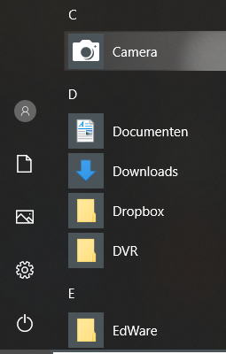
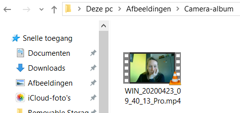
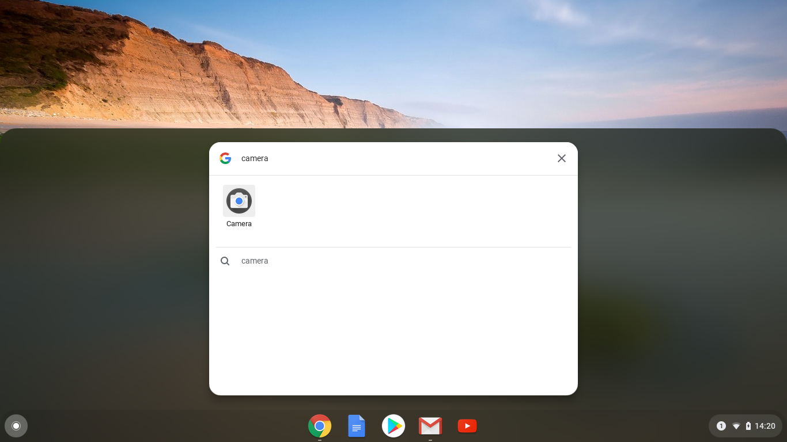

## Neem je video op

Je kunt geen opgenomen video toevoegen aan Scratch, maar je kunt wel GIF's importeren. Als je een GIF als sprite importeert, deelt Scratch de GIF op in frames en elk frame wordt een nieuw uiterlijk voor de nieuwe sprite.

**Vergeet niet dat de video die je gaat maken openbaar is, dus zorg ervoor dat er niets in zit dat je naam of locatie in de opname kan identificeren, en vraag eerst toestemming aan je ouders om de video te maken en te gebruiken.**

--- task ---

Bekijk de samengevouwen secties hieronder om je te helpen een paar seconden video op te nemen met de webcam van je computer en sla de video vervolgens op je harde schijf op.

---/task---

--- collapse ---
---

title: Webcamvideo opnemen op Windows

---
- Klik op het **Start** menu en kies de **Camera** app.

- Klik op de **Record** knop om een paar seconden video op te nemen.

- Je video zou moeten verschijnen in je `Afbeeldingen\Camera-album` map.

--- /collapse ---

--- collapse ---
---

title: Webcamvideo opnemen op macOS

---
- Ga naar je **Applicaties** menu en open QuickTime Player.

- Klik op **Bestand** > **Nieuwe filmopname** en geef vervolgens toegang tot de camera wanneer daarom wordt gevraagd.

- Als je klaar bent, kun je je video opslaan of exporteren en zou deze op je bureaublad moeten verschijnen.

--- /collapse ---

--- collapse ---
---

title: Webcamvideo opnemen op Chrome OS

---

- Klik op je applicatiestarter en zoek naar de **Camera** app.

- Selecteer **Video** aan de rechterkant en klik vervolgens op de **Record** knop.

- Als je klaar bent, klik je opnieuw op de **Record** knop, en je zult je bestand vinden in de `Video's` map.

--- /collapse ---

Nu je de video hebt, moet je deze converteren naar een GIF. Een makkelijke manier om dit te doen is door [de converter te gebruiken op rpf.io/gif](https://rpf.io/gif) {:target="_blank"}.

--- task ---

Upload eerst je video: klik op de **Bladeren** knop, klik op je bestand en klik vervolgens op de **Uploaden** knop.

---/task---

--- task ---

Om dingen in Scratch iets sneller te maken, moet je de GIF optimaliseren. Selecteer hiervoor **Optimize** checkbox. Mogelijk wil je ook de resolutie verlagen.

---/task---

--- task ---

Klik op de **Convert** knop, en wanneer de GIF is gemaakt, klik op het **Save** pictogram om je GIF op te slaan.

 

---/task---

--- task ---

Kijk of de GIF in je `Downloads` map staat.

---/task---

