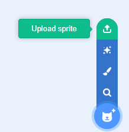
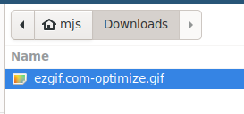
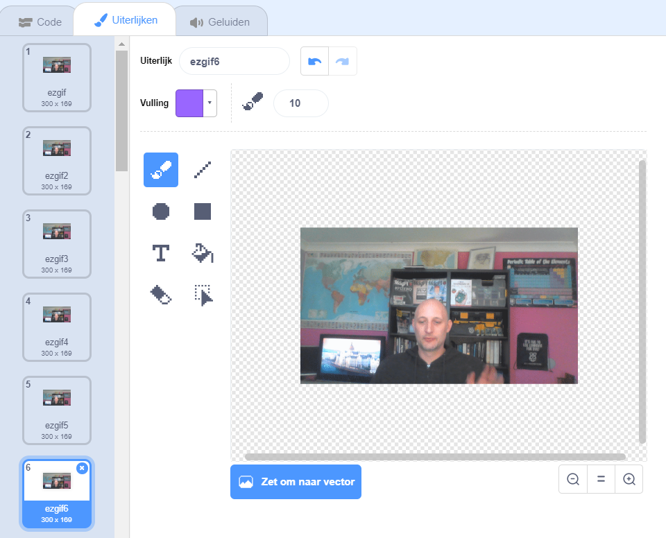

## Een GIF toevoegen en animeren in Scratch

--- task ---

Ga naar [rpf.io/scratch-new](https://rpf.io/scratch-new) om een nieuw Scratch project te openen.

---/task---

--- task ---

Klik op het **Prullenbak** icoon om de huidige kat sprite te verwijderen.


---/task---

--- task ---

Beweeg nu over de **Kies een Sprite** knop en klik vervolgens op **Upload Sprite** om een nieuwe sprite te uploaden.



---/task---

--- task ---

Selecteer je GIF in de bestandsbrowser en upload deze vervolgens.



---/task---

--- task ---

Klik op het **Uiterlijken** tabblad voor je nieuwe sprite en je zou alle individuele frames van je GIF moeten zien.



Noteer het totale aantal uiterlijken dat je hebt, want dit zal belangrijk zijn bij de volgende taak.

---/task---

--- task ---

Om de GIF af te spelen, kun je een `herhaal`{:class="block3control"} blok gebruiken, binnen een `herhaal`{:class="block3control"} blok. Het binnenste `herhaal`{:class="block3control"} blok moet overeenkomen met het aantal frames van de geïmporteerde GIF.

```blocks3
when flag clicked
forever
repeat (35)
next costume
```
---/task---

--- task ---

Je animatie is misschien een beetje snel, dus gebruik een `wacht`{:class="block3control"} blok om het een beetje te vertragen.


```blocks3
when flag clicked
forever
repeat (35)
+wait (0.04) seconds
next costume
```

---/task---

--- task ---

Mogelijk wil je ook de animatie vergroten en in het midden van het speelveld plaatsen.

```blocks3
when flag clicked
+set size to (150) %
forever
repeat (35)
+wait (0.04) seconds
next costume
```

---/task---

--- task ---

Het is ook handig om ervoor te zorgen dat je animatie altijd begint te spelen vanaf het eerste uiterlijk.

```blocks3
when flag clicked
+switch costume to (ezgif v)
set size to (150) %
forever
repeat (35)
+wait (0.04) seconds
next costume
```

---/task---


--- task ---

Klik op de groene vlag om te zien hoe je video op het speelveld wordt afgespeeld.

---/task---


