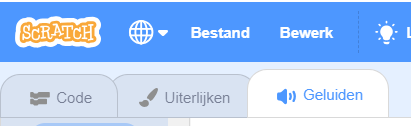
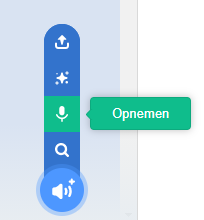
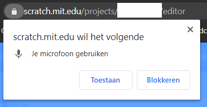
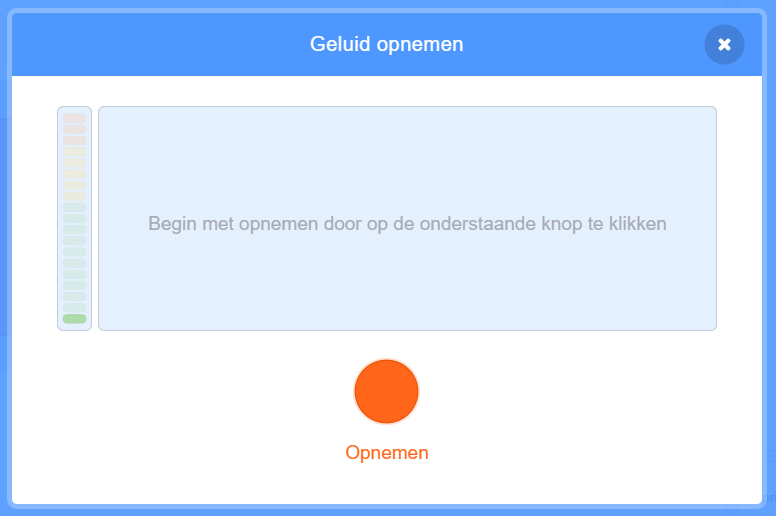

## Voeg wat geluid toe

--- task ---

Klik op de **Geluiden** tab van je sprite.



--- /task ---

--- task ---

Beweeg de muisaanwijzer links onderin het scherm over de **Kies een geluid** knop en selecteer **Opnemen** om een nieuw geluid op te nemen.



--- /task ---

--- task ---

Mogelijk moet je jouw webbrowser toegang geven tot je microfoon. Klik vervolgens op **Toestaan**.



-- /task ---

--- task ---

Klik op de **Opnemen** knop om een paar seconden je stem op te nemen. Als je klaar bent met je bericht voor de ontvanger van je e-card, klik je op **Stop met opnemen** en klik vervolgens op **Opslaan**.



--- /task ---

--- task ---

Om het geluid af te spelen, kun je een `zend signaal`{:class="block3control"} blok gebruiken aan het begin van de animatielus.

```blocks3
when flag clicked
switch costume to (ezgif v)
set size to (150) %
forever
+broadcast (message1 v)
repeat (35)
next costume
```

--- /task ---

--- task ---

Gebruik vervolgens een `wanneer ik signaal ontvang`{:class="block3control"} blok om het geluid af te spelen.

```blocks3
when I receive (message1 v)
play sound (recording1 v) until done
```

--- /task ---

--- task ---

Misschien wil je een `wacht`{:class="block3control"} blok gebruiken om te bepalen wanneer het geluid wordt afgespeeld.

```blocks3
when I receive (message1 v)
+wait (0.4) seconds
play sound (recording1 v) until done
```

--- /task ---


