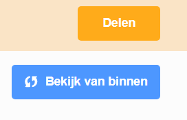
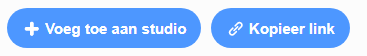

## Deel je e-card met vrienden en familie

Nu je je audiovisuele e-card hebt gemaakt, is het tijd om deze te delen met je vrienden en familie.

--- task ---

Zorg ervoor dat je bent aangemeld bij Scratch en klik vervolgens op de **Delen** knop, zodat anderen je project kunnen bekijken.

---/task---

--- task ---

Wanneer je project is gedeeld, klik je op de **Bekijk van binnen** knop. Dit kan even duren, omdat de GIF moet worden geüpload.

--- /task ---

--- task ---

Je kunt nu de link voor je project kopiëren en delen via e-mail, een sociaal netwerk of een berichtenplatform.

-- /task ---

