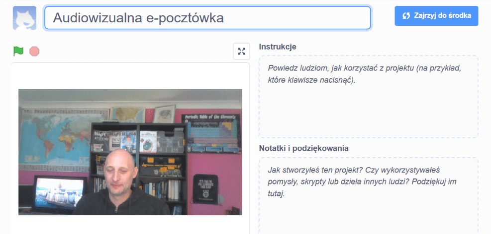

## Wprowadzenie

W tym projekcie wykorzystasz platformę Scratch do stworzenia audiowizualnej e-pocztówki, którą możesz wysłać znajomym i rodzinie.

### Co stworzysz

--- no-print --- Kliknij zieloną flagę, aby zobaczyć e-pocztówkę. <iframe src="https://scratch.mit.edu/projects/419313682/embed" allowtransparency="true" width="485" height="402" frameborder="0" scrolling="no" allowfullscreen mark="crwd-mark"></iframe>

--- /no-print ---

--- print-only ---  --- /print-only ---

--- collapse ---
---
title: Czego będziesz potrzebować
---
### Sprzęt

- Komputer z kamerą internetową i mikrofonem
- Połączenie z Internetem

### Oprogramowanie

- Scratch 3 ([online](http://rpf.io/scratchon) lub [offline](http://rpf.io/scratchoff))
- Przeglądarka internetowa

--- /collapse ---

--- collapse ---
---
title: Czego się nauczysz
---

- Jak przekonwertować film na GIF
- Jak animować GIF w Scratch
- Jak dodać nagrany dźwięk do animacji

--- /collapse ---

--- collapse ---
---
title: Dodatkowe informacje dla nauczycieli
---

Jeśli chcesz wydrukować ten projekt, użyj [wersji do druku](https://projects.raspberrypi.org/en/projects/av-e-card/print){:target="_blank"}.

--- /collapse ---
