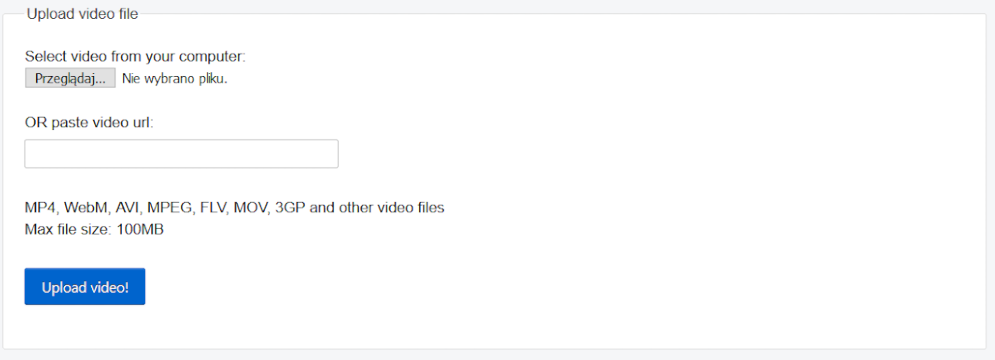
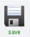

## Nagraj swoje wideo

Nie możesz dodać nagranego wideo do Scratch, ale możesz importować pliki GIF. Po zaimportowaniu pliku GIF jako duszka, Scratch dzieli plik GIF, a każda klatka pliku GIF staje się nowym kostiumem dla nowego duszka.

**Pamiętaj, że wideo, które zamierzasz utworzyć, będzie publiczne, więc upewnij się, że nie masz nic, co mogłoby zidentyfikować jak się nazywasz lub lokalizację w kadrze, i uzyskaj zgodę rodziców na utworzenie i wykorzystanie tego filmu w pierwszej kolejności.**

--- task ---

Spójrz na zwinięte sekcje poniżej, aby pomóc Ci nagrać kilka sekund wideo za pomocą kamery internetowej komputera, a następnie zapisać wideo na dysku.

--- /task ---

--- collapse ---
---
title: Nagrywanie wideo z kamery internetowej w systemie Windows
---

- Kliknij przycisk menu **Start** i wybierz aplikację **Aparat**.

- Kliknij przycisk**Zarejestruj: Wideo**, aby nagrać kilka sekund wideo.

- Twój film powinien pojawić się w folderze ` Obrazy\Z aparatu`.

--- /collapse ---

--- collapse ---
---
title: Nagrywanie wideo z kamery internetowej w systemie macOS
---

- Przejdź do menu **Aplikacje**i otwórz QuickTime Player.

- Kliknij **Plik** > **Nowe nagranie filmowe**, po wyświetleniu monitu zezwól na dostęp do kamery.

- Po zakończeniu możesz zapisać lub wyeksportować wideo, które powinno pojawić się na pulpicie.

--- /collapse ---

--- collapse ---
---
title: Nagrywanie wideo z kamery internetowej w systemie ChromeOS
---

- Kliknij program uruchamiający aplikację i wyszukaj aplikację **kamera**.

- Wybierz **Film** po prawej stronie, a następnie kliknij przycisk **rozpocznij nagrywanie**.

- Po zakończeniu kliknij przycisk **Nagrywanie** ponownie, a plik znajdziesz w folderze `Wideo`.

--- /collapse ---

Teraz, gdy masz już wideo, musisz przekonwertować je na GIF. Prostym sposobem na to jest użycie [konwertera na rpf.io/gif](https://rpf.io/gif){:target="_blank"}.

--- task ---

First, upload your video: click the **Browse** button, click on your file, then click the **Upload video** button.

--- /task ---

--- task ---

Aby sprawić, by w Scratch było trochę szybciej, powinieneś zoptymalizować GIF. Aby to zrobić, wybierz opcję **Optimize** w polu wyboru. Możesz także zmniejszyć rozdzielczość.

--- /task ---

--- task ---

Click the **Convert to GIF** button, and when the GIF has been created, click on the **Save** icon to save your GIF.

 

--- /task ---

--- task ---

Po zakończeniu sprawdź folder `Pobrane` w celu znalezienie pliku GIF-a.

--- /task ---

