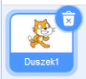
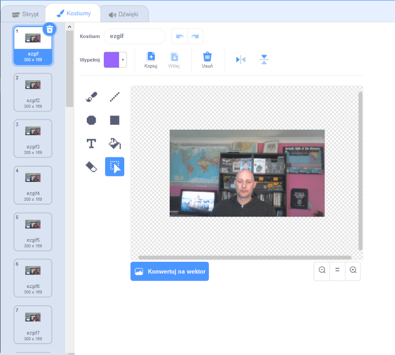

## Jak animować GIF w Scratch

--- task ---

Przejdź do [rpf.io/scratch-new](https://rpf.io/scratch-new) aby otworzyć nowy projekt Scratch.

--- /task ---

--- task ---

Kliknij ikonę **Kosza** aby usunąć domyślnego duszka kota.



--- /task ---

--- task ---

Teraz najedź kursorem na **Wybierz duszka** a następnie kliknij **Wczytaj duszka** aby przesłać nowego duszka.


--- /task ---

--- task ---

Wybierz plik GIF w przeglądarce plików, a następnie prześlij go.


--- /task ---

--- task ---

Kliknij zakładkę **Kostiumy** dla nowego duszka i powinieneś zobaczyć wszystkie pojedyncze klatki z GIF-a.



Zanotuj liczbę wszystkich kostiumów, które masz, ponieważ będzie to ważne w następnym zadaniu.

--- /task ---

--- task ---

Aby odtworzyć plik GIF, możesz użyć bloku`powtarzaj`{:class="block3control"}, wewnątrz bloku `zawsze`{:class="block3control"}. Blok `powtarzaj`{:class="block3control"} powinien pasować do liczby ramek z zaimportowanego pliku GIF.

```blocks3
when flag clicked
forever
repeat (35)
next costume
```
--- /task ---

--- task ---

Twoja animacja może być trochę za szybka, więc dodaj blok `czekaj`{:class="block3control"}, aby go nieco spowolnić.


```blocks3
when flag clicked
forever
repeat (35)
+wait (0.04) seconds
next costume
```

--- /task ---

--- task ---

Możesz także zwiększyć rozmiar animacji i przesunąć ją na środek sceny.

```blocks3
when flag clicked
+set size to (150) %
forever
repeat (35)
+wait (0.04) seconds
next costume
```

--- /task ---

--- task ---

Pomocne jest również upewnienie się, że zawsze zaczynasz odtwarzać animację od pierwszego kostiumu.

```blocks3
when flag clicked
+switch costume to (ezgif v)
set size to (150) %
forever
repeat (35)
+wait (0.04) seconds
next costume
```

--- /task ---


--- task ---

Kliknij zieloną flagę, aby obejrzeć wideo odtwarzane na scenie.

--- /task ---


