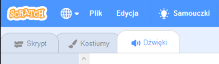
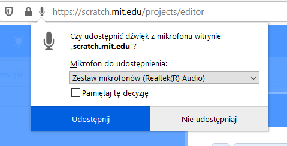
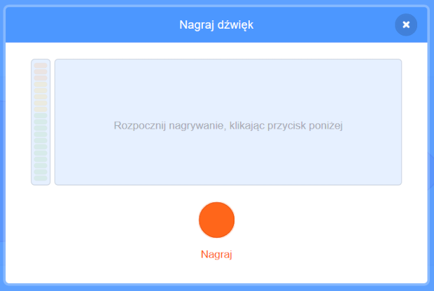

## Dodaj trochę dźwięku

--- task ---

Kliknij zakładkę **Dźwięki** twojego duszka.



--- /task ---

--- task ---

W lewym dolnym rogu ekranu najedź kursorem na **Wybierz dźwięk** i wybierz opcję **Nagraj** aby nagrać nowy dźwięk.


--- /task ---

--- task ---

Może być konieczne zezwolenie przeglądarce na dostęp do mikrofonu. Aby to zrobić, kliknij **Udostępnij**.



--- /task ---

--- task ---

Kliknij przycisk **Nagraj**, aby rozpocząć nagrywanie twojego głosu. Kiedy skończysz swoją wiadomość dla adresata twojej e-pocztówki, kliknij **Zatrzymaj nagrywanie**, a później kliknij **Zapisz**.



--- /task ---

--- task ---

Aby odtworzyć dźwięk, możesz użyć blok `nadaj komunikat`{:class="block3control"} podczas uruchamiania pętli animacji.

```blocks3
when flag clicked
switch costume to (ezgif v)
set size to (150) %
forever
+broadcast (message1 v)
repeat (35)
+wait (0.04) seconds
next costume
```

--- /task ---

--- task ---

Następnie, użyj bloku `kiedy otrzymam`{:class="block3control"} aby rozpocząć odtwarzanie dźwięku.

```blocks3
when I receive (message1 v)
play sound (recording1 v) until done
```

--- /task ---

--- task ---

Może chcesz użyć bloku `czekaj`{:class="block3control"}, aby kontrolować, kiedy dźwięk zaczyna być odtwarzany.

```blocks3
when I receive (message1 v)
+wait (0.4) seconds
play sound (recording1 v) until done
```

--- /task ---


