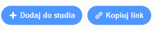

## Podziel się swoją e-pocztówką z rodziną i znajomymi

Po utworzeniu audiowizualnej e-pocztówki nadszedł czas, aby udostępnić ją znajomym i rodzinie.

--- task ---

Upewnij się, że jesteś zalogowany w Scratch, a następnie kliknij przycisk**Udostępnij**, aby umożliwić innym wyświetlanie twojego projektu.

--- /task ---

--- task ---

Po udostępnieniu projektu kliknij przycisk **Zobacz stronę projektu**. Może to zająć trochę czasu, ponieważ plik GIF musi zostać przesłany.

--- /task ---

--- task ---

Możesz teraz skopiować link do swojego projektu i udostępnić go przez e-mail, sieć społecznościową lub platformę do przesyłania wiadomości.

--- /task ---

