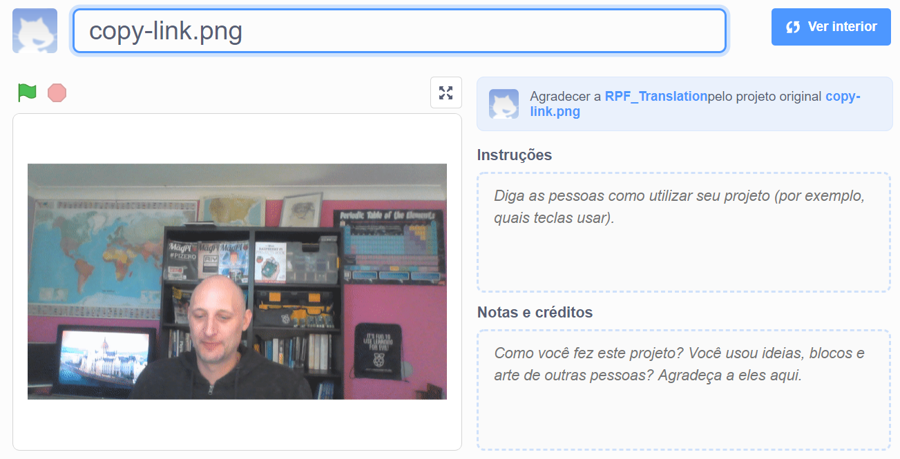

## Introdução

Neste projeto, você vai utilizar a plataforma Scratch para criar um cartão eletrônico audiovisual que pode ser enviado para amigos e familiares.

### O que você vai fazer

--- no-print --- Clique na bandeira verde para ver o cartão eletrônico. 
<iframe src="https://scratch.mit.edu/projects/385557938/embed" allowtransparency="true" width="485" height="402" frameborder="0" scrolling="no" allowfullscreen mark="crwd-mark"></iframe>

--- /no-print ---

--- print-only ---  --- /print-only ---

--- collapse ---
---
title: O que você vai precisar
---
### Hardware

- Um computador com uma câmera e microfone
- Uma conexão com a internet

### Software

- Scratch 3 ([online](http://rpf.io/scratchon) ou [off-line](http://rpf.io/scratchoff))
- Um navegador da web

--- /collapse ---

--- collapse ---
---
title: O que você vai aprender
---

- Como converter um vídeo em um GIF
- Como animar um GIF no Scratch
- Como adicionar som a uma animação

--- /collapse ---

--- collapse ---
---
title: Informações adicionais para educadores
---

Se você precisar imprimir este projeto, por favor, use a [versão para impressão](https://projects.raspberrypi.org/pt-BR/projects/av-e-card/print){:target="_blank"}.

--- /collapse ---
