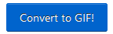

## Grave seu vídeo

Você não pode adicionar vídeo gravado ao Scratch, mas pode importar GIFs. Quando você importa um GIF como um ator, o Scratch divide o GIF e cada quadro do GIF se torna um novo traje para o ator.

**Lembre-se de que o vídeo que você criará será público, portanto, não tenha nada que possa identificar seu nome ou local na foto e obtenha a permissão de seus pais para criar e usar o vídeo primeiro.**

--- task ---

Observe as seções recolhidas abaixo para ajudá-lo a gravar alguns segundos de vídeo usando a câmera do seu computador e salve o vídeo na sua unidade de armazenamento.

--- /task ---

--- collapse ---
---

título: Gravando vídeo com a câmera no Windows

---
- Clique no botão **Iniciar** e escolha o aplicativo **Câmera**.

- Clique no botão **Capturar Vídeo** para gravar alguns segundos de vídeo.

- Seu vídeo deve aparecer na pasta `Imagens\Imagens da Câmera`.

--- /collapse ---

--- collapse ---
---

título: Gravando vídeo com a câmera no macOS

---
- Vá para seus **Aplicativos** menu e abra o QuickTime Player.

- Clique no **Arquivo** > **Nova gravação de vídeo**, então permita o acesso à câmera quando solicitado.

- Quando tiver terminado você pode salvar ou exportar seu vídeo, que deve aparecer na sua área de trabalho.

--- /collapse ---

--- collapse ---
---

title: Gravando vídeo com a câmera no Chrome OS

---

- Clique no menu de aplicativos e procure o aplicativo **Câmera**.

- Selecione **Vídeo** no lado direito e clique no botão **Gravar**.

- Quando você tiver terminado, clique no botão **Gravar** novamente e encontrará seu arquivo na pasta `Vídeos`.

--- /collapse ---

Agora que você possui o vídeo, precisa convertê-lo em um GIF. Uma maneira fácil de fazer isso é usar [o conversor em rpf.io/gif ](https://rpf.io/gif){:target="_blank"}.

--- task ---

First, upload your video: click the **Browse** button, click on your file, then click the **Upload video** button.

--- /task ---

--- task ---

Para tornar as coisas um pouco mais rápidas no Scratch, você deve otimizar o GIF. Para fazer isso, selecione a caixa de seleção **Optimize for static background**. Você também pode querer reduzir a resolução.

--- /task ---

--- task ---

Click the **Convert to GIF** button, and when the GIF has been created, click on the **Save** icon to save your GIF.

 

--- /task ---

--- task ---

Quando terminar, verifique sua pasta `Downloads` para localizar o GIF.

--- /task ---

