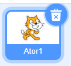
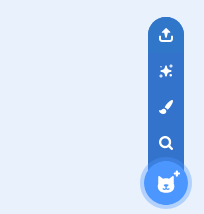
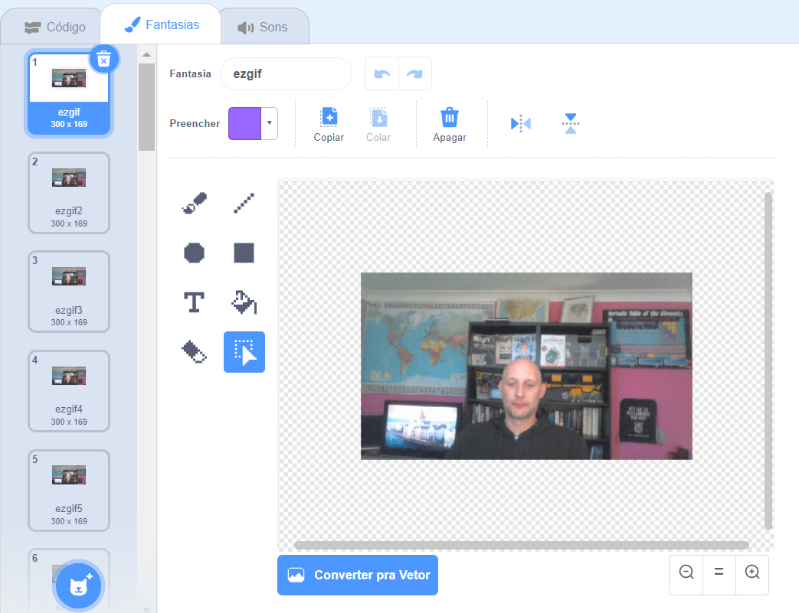

## Adicione e anime seu GIF no Scratch

--- task ---

Navegue para [rpf.io/scratch-new](https://rpf.io/scratch-new) para abrir um novo projeto do Scratch.

--- /task ---

--- task ---

Clique na **lixeira** para remover o ator padrão do Scratch.



--- /task ---

--- task ---

Agora, passe o mouse sobre o botão **Selecione um Ator** e clique em **Enviar Ator** para carregar um novo ator.



--- /task ---

--- task ---

Selecione seu GIF no na pasta de arquivos e faça o carregamento.


--- /task ---

--- task ---

Clique na guia **Fantasias** para o seu novo ator e você verá todos os quadros individuais do seu GIF.



Anote o número total de fantasias que você tem, pois isso será importante na próxima tarefa.

--- /task ---

--- task ---

Para reproduzir o GIF, você pode usar um bloco `repita`{:class="block3control"}, dentro de um bloco `sempre`{:class="block3control"}. O bloco `repita`{:class="block3control"} deve corresponder ao número de quadros do GIF importado.

```blocks3
quando bandeira verde for clicado
sempre
repita (35) vezes
próxima fantasia
```
--- /task ---

--- task ---

Sua animação pode estar um pouco rápida, então adicione um bloco `espere`{:class="block3control"} para desacelerar um pouco.


```blocks3
quando bandeira verde for clicado
sempre
repita (35) vezes
+ espere (0.04) seg
próxima fantasia
```

--- /task ---

--- task ---

Você também pode aumentar o tamanho da animação e reposicioná-la no centro do palco.

```blocks3
when flag clicked
+set size to (150) %
forever
repeat (35)
+wait (0.04) seconds
next costume
```

--- /task ---

--- task ---

Também é importante garantir que você sempre comece a reproduzir a animação da primeira fantasia.

```blocks3
when flag clicked
+switch costume to (ezgif v)
set size to (150) %
forever
repeat (35)
+wait (0.04) seconds
next costume
```

--- /task ---


--- task ---

Clique na bandeira verde para assistir ao vídeo sendo reproduzido no palco.

--- /task ---


