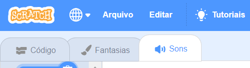
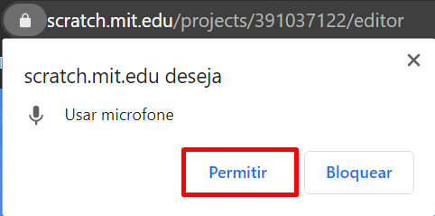
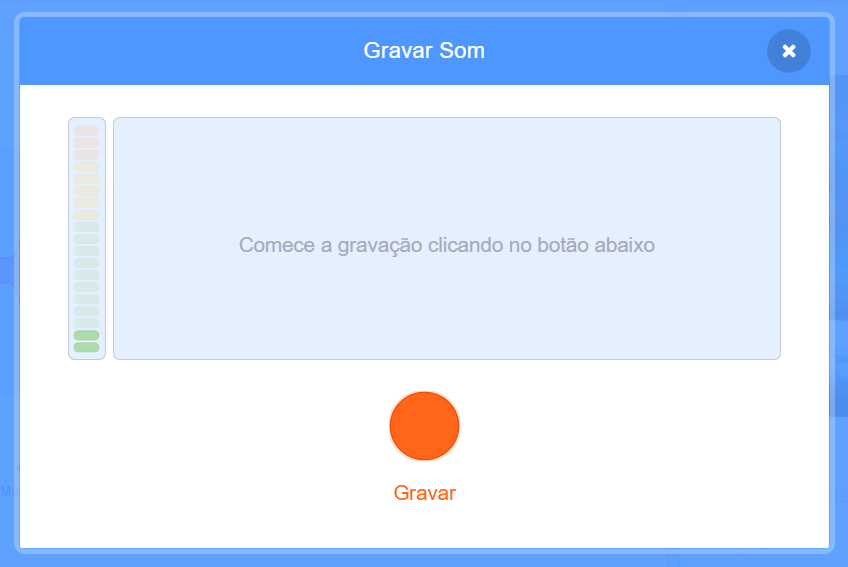

## Adicione um som

--- task ---

Clique na aba **Sons**.



--- /task ---

--- task ---

No canto inferior esquerdo da tela, passe o mouse sobre o botão **Selecionar um Som** e selecione **Gravar** para gravar um novo som.


--- /task ---

--- task ---

Pode ser necessário permitir que seu navegador da web acesse seu microfone. Para fazer isso, clique em **Permitir** .



--- /task ---

--- task ---

Clique no botão **Gravar** para começar a gravar sua voz. Quando você terminar sua mensagem para o destinatário do seu cartão eletrônico, clique em **Parar a gravação** e clique em **Salvar** .



--- /task ---

--- task ---

Para reproduzir o som, você pode usar um bloco `transmita`{:class="block3control"} quando o laço de animação iniciar.

```blocks3
when flag clicked
switch costume to (ezgif v)
set size to (150) %
forever
+broadcast (mensagem1 v)
repeat (35)
next costume
```

--- /task ---

--- task ---

Em seguida, use o bloco `quando eu receber`{:class="block3control"} para começar a tocar o som.

```blocks3
quando eu receber (mensagem1 v)
toque o som (gravacao1 v) até o fim
```

--- /task ---

--- task ---

Você pode usar um bloco `espere () seg`{:class="block3control"} para controlar quando o som começa a ser reproduzido.

```blocks3
quando eu receber (mensagem1 v)
+ espere (0.4) seg
toque o som (gravacao1 v) até o fim
```

--- /task ---


