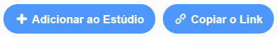

## Compartilhe seu cartão eletrônico com amigos e familiares

Agora que você criou seu cartão eletrônico audiovisual, é hora de compartilhá-lo com seus amigos e familiares.

--- task ---

Verifique se você está conectado ao Scratch e clique no botão **Compartilhar** para permitir que outras pessoas visualizem seu projeto.

--- /task ---

--- task ---

Quando o seu projeto tiver sido compartilhado, clique no botão **Veja a Página do Projeto**. Isso pode levar algum tempo, pois o GIF precisa ser carregado.

--- /task ---

--- task ---

Agora você pode copiar o link do seu projeto e compartilhá-lo por email, rede social ou plataforma de mensagens.

--- /task ---

***
Tradução Contribuída pela Comunidade

Este projeto foi traduzido por Flavio Silva e revisado por Elton Marques.

Nossos incríveis voluntários de tradução nos ajudam a dar as crianças em todo o mundo a oportunidade de aprender a programar. Você pode nos ajudar a alcançar mais crianças traduzindo nossos projetos - leia mais em [rpf.io/translate](https://rpf.io/translate).

