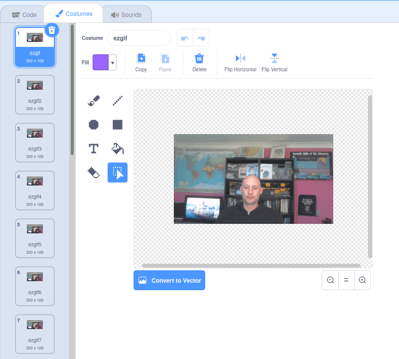

## Add and animate your GIF in Scratch

--- task ---

Navigate to [rpf.io/scratch-new](https://rpf.io/scratch-new) to open a new Scratch project.

--- /task ---

--- task ---

Click on the **bin** icon to remove the default Scratch Cat sprite.


--- /task ---

--- task ---

Now, hover over the **Choose a Sprite** button, then click on **Upload Sprite** to upload a new sprite.


--- /task ---

--- task ---

Select your GIF from the file browser, then upload it.


--- /task ---

--- task ---

Click on the **Costumes** tab for your new sprite and you should see all the individual frames from your GIF.



Make a note of the total number of costumes that you have, as this will be important in the next task.

--- /task ---

--- task ---

To play through the GIF, you can use a `repeat`{:class="block3control"} block, inside a `forever`{:class="block3control"} block. The `repeat`{:class="block3control"} block should match the number of frames from the imported GIF.

```blocks3
when flag clicked
forever
repeat (35)
next costume
```
--- /task ---

--- task ---

Your animation might be a little fast, so add a `wait`{:class="block3control"} block to slow it down a little.


```blocks3
when flag clicked
forever
repeat (35)
+wait (0.04) seconds
next costume
```

--- /task ---

--- task ---

You might also like to increase the size of the animation and reposition it in the centre of the Stage.

```blocks3
when flag clicked
+set size to (150) %
forever
repeat (35)
+wait (0.04) seconds
next costume
```

--- /task ---

--- task ---

It's also helpful to make sure you always start playing the animation from the first costume.

```blocks3
when flag clicked
+switch costume to (ezgif v)
set size to (150) %
forever
repeat (35)
+wait (0.04) seconds
next costume
```

--- /task ---


--- task ---

Click the green flag to watch your video being played on the Stage.

--- /task ---


