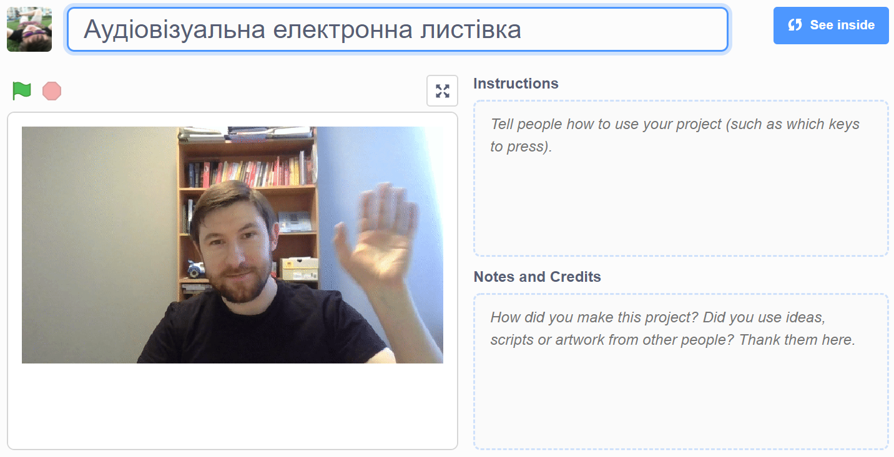

## Вступ

У цьому проєкті ти використаєш платформу Скретч, щоб зробити аудіовізуальну електронну листівку, яку ти зможеш відіслати друзям та родині.

### Що ти зробиш

--- no-print --- Натисни на зелений прапорець, щоб переглянути електронну листівку. <iframe src="https://scratch.mit.edu/projects/419313682/embed" allowtransparency="true" width="485" height="402" frameborder="0" scrolling="no" allowfullscreen></iframe>

--- /no-print ---

--- print-only ---  --- /print-only ---

--- collapse ---
---
title: Що тобі знадобиться
---
### Обладнання

- Комп'ютер із вебкамерою та мікрофоном
- З'єднання з інтернетом

### Програмне забезпечення

- Скретч 3 ([онлайн](http://rpf.io/scratchon) або [офлайн](http://rpf.io/scratchoff))
- Веббраузер

--- /collapse ---

--- collapse ---
---
title: Чого ти навчишся
---

- Як конвертувати відео в GIF
- Як анімувати GIF у Скретч
- Як додати записаний звук до анімації

--- /collapse ---

--- collapse ---
---
title: Додаткова інформація для викладачів
---

Якщо вам потрібно роздрукувати цей проєкт, будь ласка, скористайтеся [версією для друку](https://projects.raspberrypi.org/en/projects/av-e-card/print){:target="_ blank"}.

--- /collapse ---
