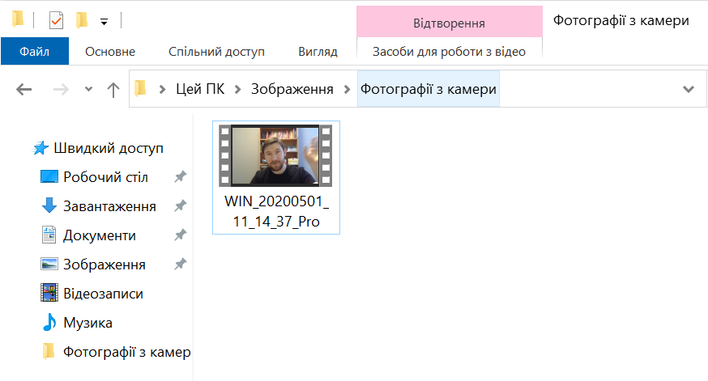
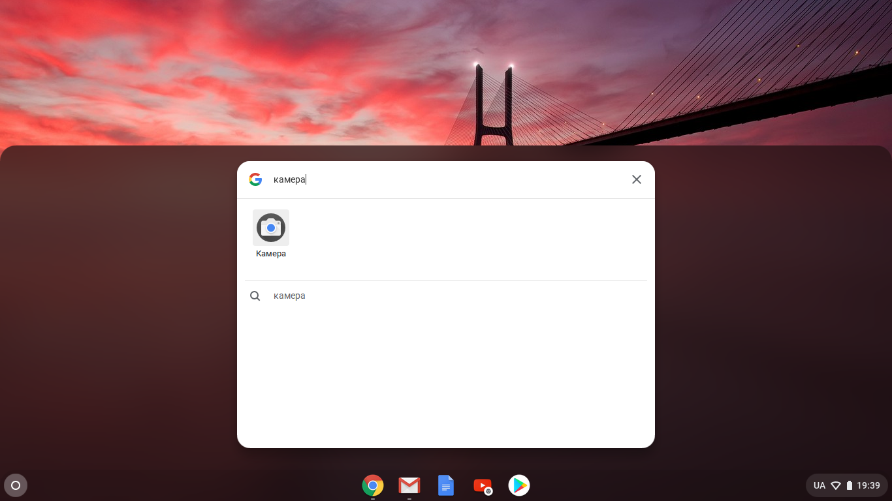
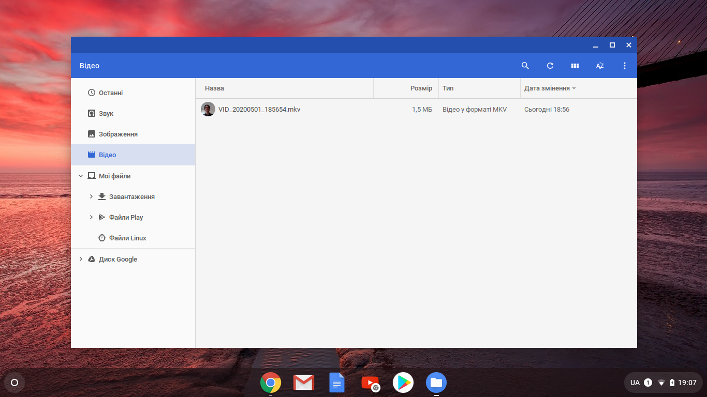

## Запиши власне відео

Ти не зможеш додати записане відео у Скретч, але ти можеш імпортувати зображення в форматі GIF. Коли ти імпортуєш GIF як спрайт, Скретч його розбиває так, що кожен кадр GIF стає новим образом твого спрайта.

**Пам'ятай, що відео, яке ти створиш, буде загальнодоступним, тому переконайся, що в кадрі немає нічого, по чому можна було б виявити твоє ім'я або місцезнахоження, також в першу чергу запитай у батьків дозволу створювати і використовувати відео.**

--- task ---

Поглянь на згорнуті нижче розділи, щоб дізнатися як записати кількасекундне відео за допомогою вебкамери свого комп'ютера і зберегти його на диску.

--- /task ---

--- collapse ---
---
title: Запис відео з вебкамери у Windows
---
- Натисни на меню **Пуск** і вибери програму **Камера**.

- Натисни кнопку **Зняти Відео**, щоб записати кількасекундне відео.

- Твоє відео має з'явитися в папці `Зображення\Фотографії з камери (Pictures\Camera Roll)`.

--- /collapse ---

--- collapse ---
---
title: Запис відео з вебкамери у macOS
---
- Перейди в меню **Програми** і відкрий QuickTime Player.

- Натисни **Файл**>**Новий відеозапис**, потім при запиті надай доступ до камери.

- Коли закінчиш, то можеш зберегти або експортувати відео, і воно з'явиться на робочому столі.

--- /collapse ---

--- collapse ---
---
title: Запис відео з вебкамери у Chrome OS
---

- Клацни на кнопку запуску програм і знайди застосунок **Камера**.

- Вибери **Відео** справа, а потім натисни кнопку **Запис**.

- Коли закінчиш, натисни знову кнопку **Запис**, і ти знайдеш свій файл у папці `Відео`.

--- /collapse ---

Тепер коли в тебе є відео, ти маєш перетворити його на GIF. Простий спосіб це зробити — використати [конвертер на rpf.io/gif](https://rpf.io/gif){:target="_blank"}.

--- task ---

Спочатку завантаж своє відео: натисни кнопку **Вибрати файл**, вибери свій файл, а потім натистни кнопку **Upload video!**.

--- /task ---

--- task ---

Для того, щоб прискорити роботу Скретч, ти маєш оптимізувати свій GIF. Для того щоб це зробити, постав галочу навпроти **Optimize**. Ти також можеш зменшити роздільну здатність.

--- /task ---

--- task ---

Натисни на кнопку **Convert to GIF!**, а коли GIF буде створено, натисни кнопку **Save**, щоб його зберегти.

 

--- /task ---

--- task ---

Коли ти закінчиш, шукай GIF в папці `Завантаження`.

--- /task ---

