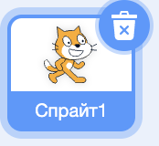
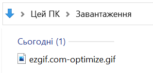
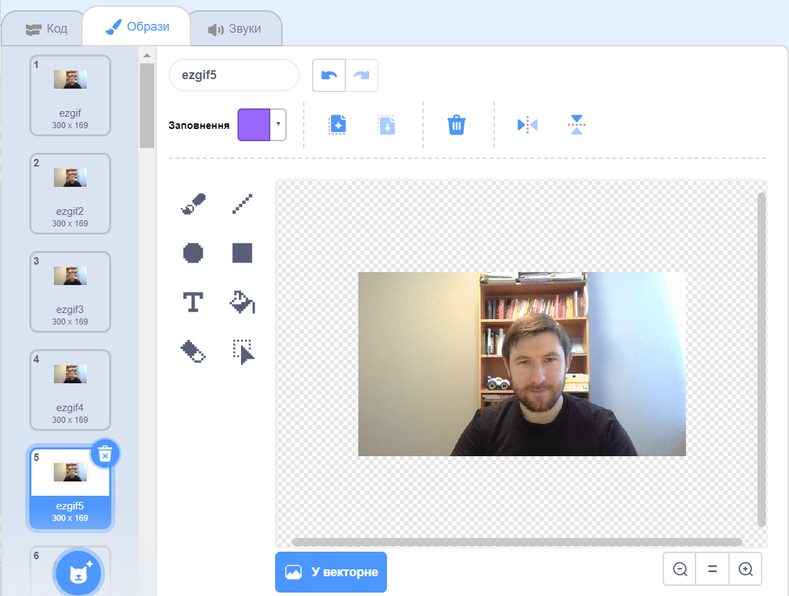

## Додай в Скретч свій GIF та анімуй його

--- task ---

Перейди на [rpf.io/scratch-new](https://rpf.io/scratch-new) і відкрий новий проєкт Скретч.

--- /task ---

--- task ---

Натисни на іконку з **кошиком**, щоб видалити стандартний у Скретч спрайт із котом.



--- /task ---

--- task ---

Тепер наведи курсор на кнопку **Обрати спрайт**, далі натисни на **Вивантажити спрайт**, щоб імпортувати новий спрайт.


--- /task ---

--- task ---

Обери свій GIF у файловому браузері і вивантаж його.



--- /task ---

--- task ---

Натисни на вкладку **Образи** свого нового спрайта, там ти маєш побачити всі кадри зі свого GIF.



Зверни увагу на загальну кількість образів, які ти маєш, бо це буде важливо на наступному кроці.

--- /task ---

--- task ---

Для відтворення GIF ти можеш використовувати блок `повторити`{:class="block3control"} всередині блока `завжди`{:class="block3control"}. Блок `повторити`{:class="block3control"} має відповідати кількості кадрів у імпортованому GIF.

```blocks3
when flag clicked
forever
repeat (35)
next costume
```
--- /task ---

--- task ---

Твоя анімація може бути занадто швидкою, тому додай блок `чекати`{:class="block3control"}, щоб трохи сповільнити її.


```blocks3
when flag clicked
forever
repeat (35)
+wait (0.04) seconds
next costume
```

--- /task ---

--- task ---

Можливо, ти ще захочеш збільшити розмір анімації і розмістити її в середині Сцени.

```blocks3
when flag clicked
+set size to (150) %
forever
repeat (35)
next costume
```

--- /task ---

--- task ---

Також важливо переконатися, що ти завжди запускаєш анімацію із першого образа.

```blocks3
when flag clicked
+switch costume to (ezgif v)
set size to (150) %
forever
repeat (35)
next costume
```

--- /task ---


--- task ---

Клацни на зелений прапорець, щоб побачити, як твоє відео відтворюється на Сцені.

--- /task ---


