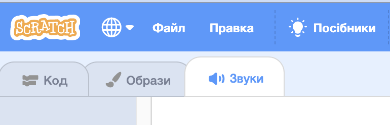
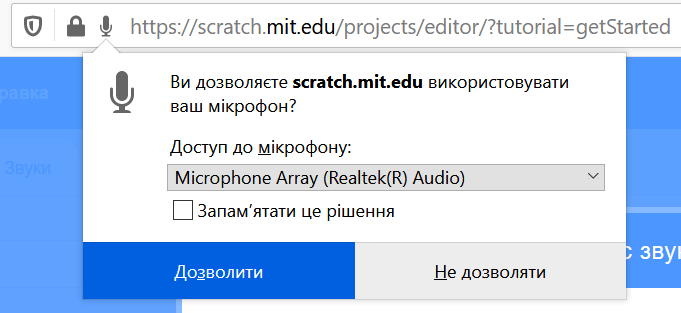
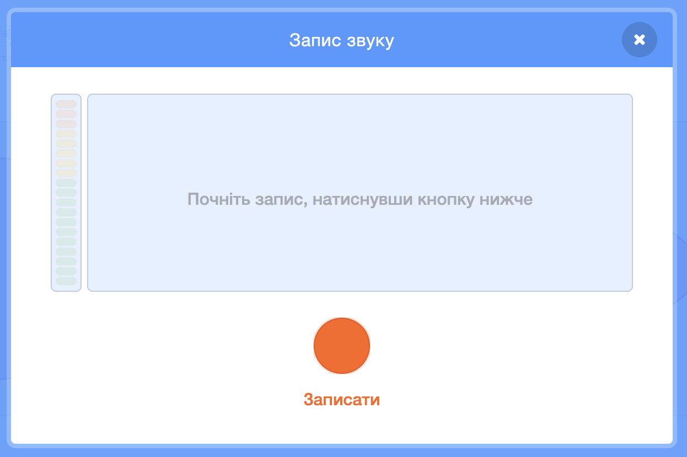

## Додай трохи звуку

--- task ---

Клацни на вкладку **Звуки** свого спрайта.



--- /task ---

--- task ---

В лівому нижньому куточку екрана, наведи курсор на кнопку **Обрати звук** і вибери **Записати** для запису нового звуку.


--- /task ---

--- task ---

Можливо тобі треба буде дозволити своєму веббраузеру використовувати мікрофон. Щоб зробити це, натисни **Дозволити**.



--- /task ---

--- task ---

Натисни на кнопку **Записати** і почни записувати свій голос. Коли скінчиш записувати повідомлення для отримувача електронної листівки, натисни **Зупинити запис**, а далі — **Зберегти**.



--- /task ---

--- task ---

Для відтворення звуку можна використовувати блок `оповістити`{:class="block3control"} на початку циклу анімації.

```blocks3
when flag clicked
switch costume to (ezgif v)
set size to (150) %
forever
+broadcast (message1 v)
repeat (35)
+wait (0.04) seconds
next costume
```

--- /task ---

--- task ---

Далі використай блок `коли я отримую`{:class="block3control"} і почни відтворювати звук.

```blocks3
when I receive (message1 v)
play sound (recording1 v) until done
```

--- /task ---

--- task ---

Можливо, ти захочеш використати блок `чекати`{:class="block3control"}, щоб контролювати початковий момент відтворення звуку.

```blocks3
when I receive (message1 v)
+wait (0.4) seconds
play sound (recording1 v) until done
```

--- /task ---


