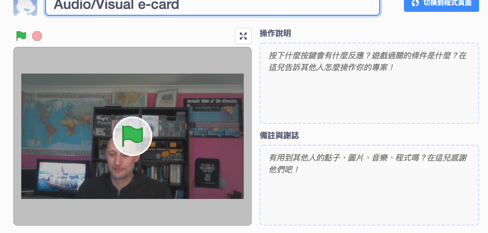

## 介紹

在此專案中，您將會使用 Scratch 平台來製作一張視聽電子賀卡，並可以寄送給親朋好友。

### 您將會做出

點擊綠色旗觀看電子賀卡。 <iframe src="https://scratch.mit.edu/projects/385557938/embed" allowtransparency="true" width="485" height="402" frameborder="0" scrolling="no" allowfullscreen mark="crwd-mark"></iframe>

--- /no-print ---

--- print-only ---  --- /print-only ---

--- collapse ---
---
title: 您需要什麼
---
### 硬體

- 一台有網路攝影機和麥克風的電腦
- 順暢的網路連線

### 軟體

- Scratch 3（ [線上版](http://rpf.io/scratchon) 或 [離線版](http://rpf.io/scratchoff) ）
- 瀏覽器

--- /collapse ---

--- collapse ---
---
title: 您會學到
---

- 如何把影片轉成GIF
- 如何在Scratch中用GIF做成動畫
- 如何增加錄音檔到動畫中

--- /collapse ---

--- collapse ---
---
title: 給老師的其它資訊
---

如果您需要列印此專案內容，請使用此 [列印版本](https://projects.raspberrypi.org/en/projects/av-e-card/print){:target =“_ blank”}。

--- /collapse ---
