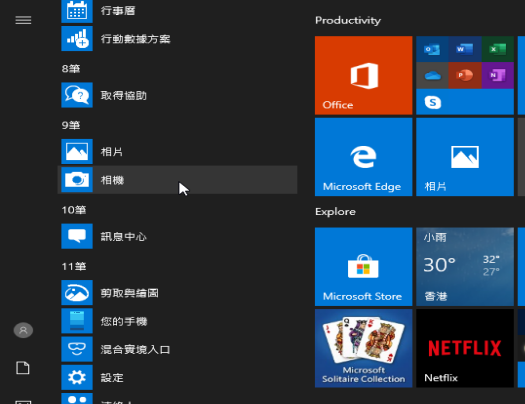
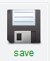

## 錄製一段您的影片

您不能添加錄製的影片到 Scratch，但可以匯入GIFs。 當你匯入GIF為角色時，Scratch 會將 GIF 分開成一張一張的圖片，並且成為這新角色的每一個新造形。

**請注意，您所製作的影片將會是公開的，因此請確保影片中沒有任何可以標識您的姓名和位置，並應先得到您父母的同意再製作和使用此影片。**

--- task ---

請查看下面關於如何在各個作業系統錄製影片的選單，錄製完畢後存取到您的電腦中。

--- /task ---

--- collapse ---
---

title: 在 Windows 上使用攝影機錄製影片

---
- 點擊 **開始** 選單，然後選擇 **相機** 應用程式。

- 點擊 **錄影** 按鈕，並錄下幾秒鐘的影片。

- 您的影片會出現在`圖片\相機膠卷中`資料夾。

--- /collapse ---

--- collapse ---
---

title: 在 macOS 上使用攝影機錄製影片

---
- 到 **應用程式** 選單，打開 QuickTime Player。

- 點擊 **檔案**>**新增影片錄製**，然後允許攝影機的存取權限。

- 完成後，您可以儲存或是輸出您的影片，檔案將會出現在桌面上。

--- /collapse ---

--- collapse ---
---

title: 在 Chrome OS 上使用攝影機錄製影片

---

- 點擊您的應用程式啟動器，然後搜尋 **相機**。

- 選擇右側 **影片**，並點擊 **錄製** 按鈕。

- 完成後，再點擊一次 **錄製** 按鈕，檔案會儲存在 `影片` 資料夾裡。

--- /collapse ---

現在您有了影片，你需要轉換成GIF。 一種最簡易的方式是使用 [rpf.io/gif](https://rpf.io/gif){:target='_blank"}轉換器。

--- task ---

首先，上傳您的影片：點擊**瀏覽**，選擇您的檔案，再按 **上傳**。

--- /task ---

--- task ---

為了使在 Scratch 時運作得更快速，您應該把 GIF 優化。 因此，將 **Optimize** 選項打勾。 你可能還想降低解析度。

--- /task ---

--- task ---

點擊 **Convert to GIF!** 轉換按鈕，當GIF製作完成後，點擊 **save** 儲存按鈕並儲存檔案。

 

--- /task ---

--- task ---

完成後，檢查您的`下載`資料夾是否有GIF。

--- /task ---

