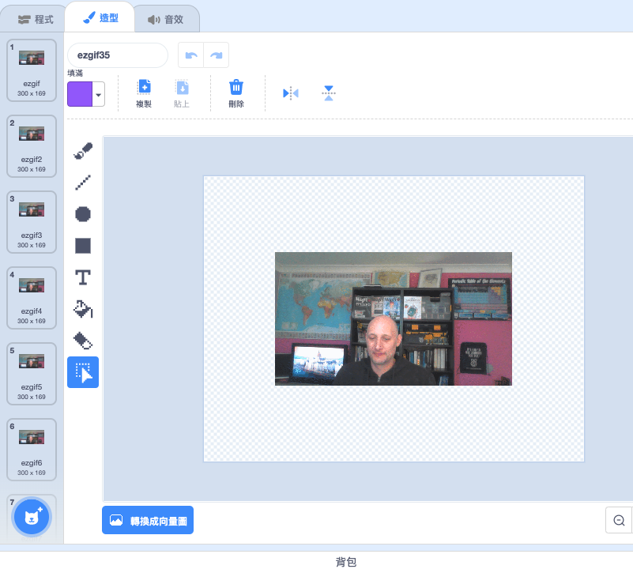

## 在Scratch加入和製作GIF動畫

--- task ---

到[rpf.io/scratch-new](https://rpf.io/scratch-new)開啟一個新的Scratch專案

--- /task ---

--- task ---

點擊 **垃圾桶** 圖標來移除當前預設的貓咪角色。


--- /task ---

--- task ---

現在呢，將滑鼠停在**選個角色**按鈕上，點擊**上傳**上傳一個新的角色。


--- /task ---

--- task ---

選擇您在資料夾中的GIF並且上傳。


--- /task ---

--- task ---

點擊您新角色的 **造形** 選單，您會看到每一張GIF的圖片。



現在記住您所有造形總數，因為這對下一個任務很重要。

--- /task ---

--- task ---

要播放GIF，您可以使用 `重複`{:class="block3control"} 積木，裡面放一個`無限次`{:class="block3control"} 積木。 `重複`{:class="block3control"} 積木應等於 GIF 的圖片數量的總和。

```blocks3
when flag clicked
forever
repeat (35)
next costume
```
--- /task ---

--- task ---

您的動畫可能會有點快，增加一個 `等待`{:class="block3control"} 積木來放慢一下速度。


```blocks3
when flag clicked
forever
repeat (35)
+wait (0.04) seconds
next costume
```

--- /task ---

--- task ---

您可能還想增加動畫的大小，並將動畫放置在舞台中央。

```blocks3
when flag clicked
+set size to (150) %
forever
repeat (35)
+wait (0.04) seconds
next costume
```

--- /task ---

--- task ---

確保每次動畫都從第一個造形開始播放也是很有幫助的。

```blocks3
when flag clicked
+switch costume to (ezgif v)
set size to (150) %
forever
repeat (35)
+wait (0.04) seconds
next costume
```

--- /task ---


--- task ---

點擊綠色旗觀看在舞台上您製作的影片。

--- /task ---


