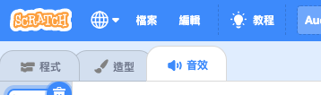
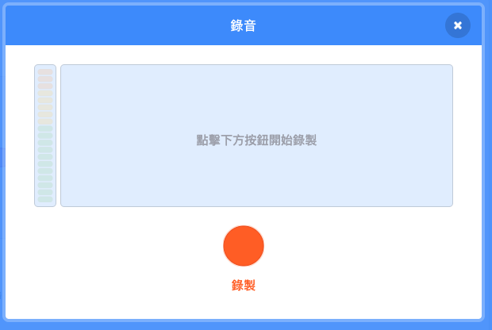

## 增加一點音效

--- task ---

點擊您角色中 **音效** 選單



--- /task ---

--- task ---

在螢幕的左下角，將鼠標移至**選個音效**按鈕，然後選擇 **錄製** 去錄製一段新的音效。


--- /task ---

--- task ---

您可能需要允許網頁瀏覽器存取您的電腦麥克風。 請點擊**允許**


--- /task ---

--- task ---

點擊 **錄製** 按鈕開始錄製您的音效。 當您完成電子賀卡的訊息錄音後，點擊 **停止錄製** 然後再按 **儲存**。



--- /task ---

--- task ---

您可以使用 `廣播訊息`{:class="block3control"} 積木在播放動畫的同時，播出音效。

```blocks3
when flag clicked
switch costume to (ezgif v)
set size to (150) %
forever
+broadcast (message1 v)
repeat (35)
+wait (0.04) seconds
next costume
```

--- /task ---

--- task ---

然後，使用一個`當收到訊息`{:class="block3control"} 積木來開始播放聲音。

```blocks3
when I receive (message1 v)
play sound (recording1 v) until done
```

--- /task ---

--- task ---

您亦可以使用 `等待`{:class="block3control"} 積木來控制什麼時候開始播放音效。

```blocks3
when I receive (message1 v)
+wait (0.4) seconds
play sound (recording1 v) until done
```

--- /task ---


